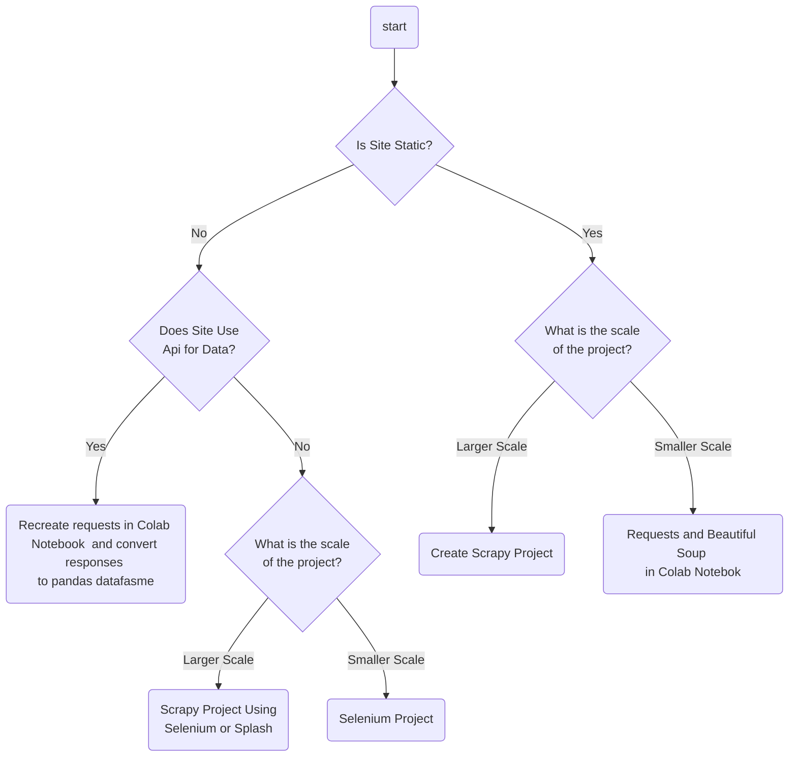

## Scraping Stacks
- **Scrapy**
    - Full Framework
    - Support for many tools below
    - Good for big projects
- Requests/Beautiful Soup/Pandas
    - Good for beginners
    - Easy use with Google Colab
    - Speed can be improved via multithreading libraries such as asyncio
- Selenium/Pandas
    - Slowest but also extremely versatile

## Essential Tools
- Developer Tools (I use Edge)
    - XPath Testing
    - Copy API requests as Curl (bash)
        - Convert with Curl to Python website
    - View webpage source files/storage
- Regular Expressions
    - Data extraction when site structure is poor
    - Versatile, but steep learning curve
- XPaths
    - Harder than Beautiful Soup but easier than Regular Expressions
    - Easily tested in devtools
- CSS Selectors
    - More readable than XPaths
    - Not always applicable
- Splash
    - Can be used to render javascript without selenium
    - Great Integration with Scrapy

## Deciding What Stack To Use

## Things to Consider
- How much time will I be spending on this?
- Do I want to risk my IP being blocked (Colab great workaround)
- How much data am I collecting (csv vs Database storage)
- How often will the site be scraped
- Legality/Morality of scrape