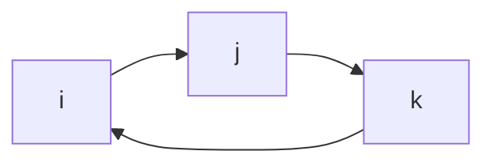

### Dot Product

#### Definition
Given 2 nonzero vectors $\vec{U}$ and $\vec{V}$ in 2D or 3D, their dot product is $\vec{U}\cdot\vec{V}= |\vec{U}||\vec{V}|\cos{\theta}$ where $\theta$ is the angle between $\vec{U}$ and $\vec{V}$ with $0\leq\theta\leq\pi$

**Equation**

$\vec{U}=\langle U_1,U_2,U_3\rangle$

$\vec{V}=\langle V_1,V_2,V_3\rangle$

$U \cdot V = U_1V_1+U_2V_2+U_3V_3=|\vec{U}||\vec{V}|\cos{\theta}$

#### Key Notes

- Dot product is commutative

### Orthogonal Vectors
Two vectors are orthogonal if $\vec{U}\cdot\vec{V}=0$. In 2D and 3D spaces, orthogonal means perpendicular ($\frac{\pi}{2}$ angle between them)
#### Key Notes
- There are an infinite number of orthogonal vectors to any one vector when length is not specified
- 
#### Projections
The orthogonal projection is a vector that goes along $\vec{U}$ with length $|\vec{V}|\cos{\theta}$

**Equation**

$proj_{\vec{U}}\vec{V}= \frac{\vec{U}}{|\vec{U}|}|\vec{V}|\cos{\theta}$

### Cross Product
#### Definition
Given two nonzero vectors $u$ and $v$ in ${\rm I\!R}^3$, the cross product is defined as $\vec{u} \times \vec{v} = |\vec{u}||\vec{u}|\sin{\theta}\vec{n}$ where $0\leq\theta\leq\pi$ is the angle between $\vec{u}$ and $\vec{v}$ and $\vec{n}$ is the unit vector which is normal (perpendicular) to $\vec{u}$ and $\vec{v}$ whose direction is determined by the right hand rule

**Equation**
$\vec{u} \times \vec{v} = |\vec{u}||\vec{u}|\sin{\theta}\vec{n}$

#### Key Notes
- $\vec{u}$ and $\vec{v}$ are parallel if and only if $\vec{u}\times\vec{v}=0$
- If $\vec{u}$ and $\vec{v}$ are two sides of a parallelogram, then the area of the paralllelogram is $|\vec{u}\times\vec{v}| = |\vec{u}||\vec{v}|\sin{\theta}$
- $\vec{v}\times\vec{u}=-(\vec{u}\times\vec{v})$
- $\vec{u}\times\vec{v}$ is orthogonal to $\vec{u}$ and $\vec{v}$ which means that $(\vec{u}\times\vec{v})\cdot\vec{u} = 0$ and $(\vec{u}\times\vec{v})\cdot\vec{v} = 0$

### Cross Product Distribution

#### With respect to addition
- $\vec{u}\times(\vec{v}+\vec{w}) = \vec{u}\times\vec{v} + \vec{u}\times\vec{w}$

- $(\vec{u}+\vec{v})\times\vec{w} = \vec{u}\times\vec{w} + \vec{v}\times\vec{w}$

#### If c is a scalar
-$(c\vec{u}\times\vec{v}=c(\vec{u}\times\vec{v})=u\times(c\vec{v})$

### Cross Products of Unit Vectors

- $\^{i}\times\^{j}=\^{k}$
- $\^{j}\times\^{k}=\^{i}$
- $\^{k}\times\^{i}=\^{j}$

- $\^{j}\times\^{i}=-\^{k}$
- $\^{k}\times\^{j}=-\^{i}$
- $\^{i}\times\^{k}=-\^{j}$

- $\^{i}\times\^{i}=0$
- $\^{j}\times\^{j}=0$
- $\^{k}\times\^{k}=0$

### Right Hand Rule

#### Definition
Finds the direction of the cross product

#### Example
**Find the direction of $\vec{a} \times \vec{b}$**

Using your right-hand:

1. point your index finger along $\vec{a}$
2. point your middle finger along vector $\vec{a}$
3. $\vec{a} \times \vec{b}$ will be in the direction of your thumb.

